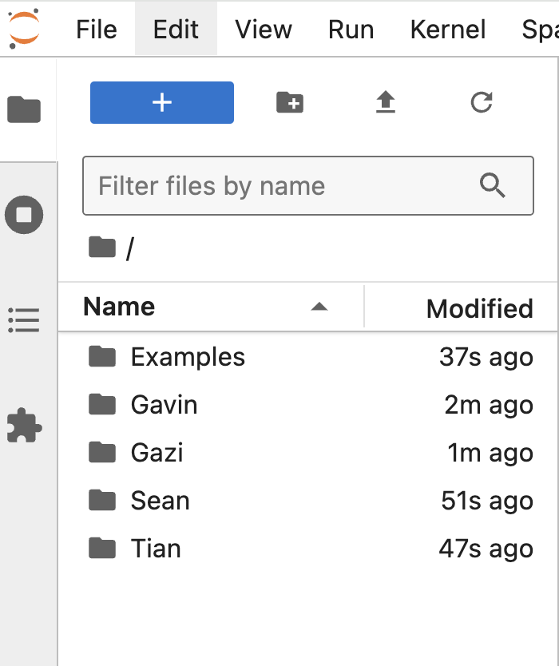
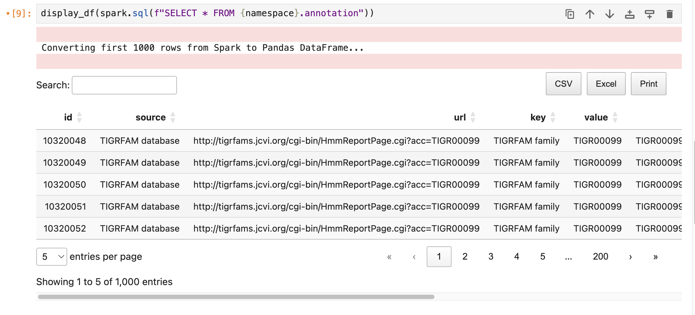
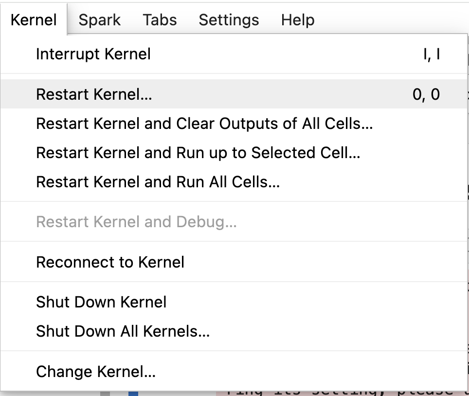

# User Guide: Accessing Spark Jupyter Notebook

## Prerequisites

### SSH Access:
   * Ensure you have SSH access to the remote server (`login1.berkeley.kbase.us`).
   * If you do not have access, please contact the KBase System Admin team.

## Step-by-Step Guide

### 1. Create SSH Tunnel:

Execute the following command to create an SSH tunnel to the remote server (`login1.berkeley.kbase.us`):

```bash
ssh -f -N -L localhost:44042:10.58.2.201:4042 <kbase_developer_username>@login1.berkeley.kbase.us
```
   
* `-f`: Run SSH command in the background.
* `-N`: Do not execute a remote command.
* `-L localhost:44041:10.58.2.201:4041`: Forward port `44041` on your local machine to port `4041` on the remote machine `10.58.2.201`.
* `<kbase_developer_username>`: Your username for SSH access. Contact the KBase System Admin team if you do not have access.
* `@login1.berkeley.kbase.us`: The remote SSH server.   
   
### 2. Access Jupyter Notebook:
   
Open a web browser and navigate to the following URL:

```
http://localhost:44041
```
This will open the Jupyter Notebook interface running on the remote server.

### 3. Working in the Shared Jupiter Notebook Environment:

Since this is a shared environment, it’s important to create your own directory and keep your work organized.




We have provided a collection of example notebooks to help you get started. You can find them in the `examples` directory.

### 4. Using Pre-loaded Functions:

To make your development easier, several helper functions and extensions are preloaded in the Jupyter environment.

#### 4.1. Creating a Spark Session:

Use the `get_spark_session` function to create or get a Spark session. 

This function will automatically set up the Spark session with the correct configurations, including setting the 
master URL and other necessary Spark configurations. By using this function, you ensure that your Spark session is 
properly configured to interact with the cluster.

##### Example Usage:
```python
spark = get_spark_session()
```

#### 4.2. Displaying DataFrames:
Use the `display_df` function to display pandas or Spark DataFrames interactively.

The `display_df` function is designed to provide an interactive tabular display of DataFrames within Jupyter Notebooks. 
It leverages the [itables](https://github.com/mwouts/itables) extension, which enhances the display of data tables by providing features like sorting, 
filtering, and pagination directly in the notebook interface.

##### Example Usage:
```python
display_df(spark.sql(f"SELECT * FROM {namespace}.annotation"))
```


### 5. Accessing Data:

#### 5.1. Showing Available Namespaces and Listing Tables:
To list all namespaces (databases) and display the tables within each namespace, you can use the following code snippet:

```python
namespaces = spark.sql("SHOW DATABASES").collect()

# List tables within each namespace
for namespace in namespaces:
    namespace_name = namespace.namespace
    print(f"Tables in namespace: {namespace_name}")
    spark.sql(f"SHOW TABLES IN {namespace_name}").show(50, truncate=False)
```

### 6. Closing the Spark Session:
Please remember to close the Spark session when you are done with your work. This will release the resources and 
prevent any memory leaks.

```python
spark.stop()
```

Please be aware that your session will automatically close after `1 hour`. Should you require an extension, simply invoke 
`get_spark_session()` to initiate a new session.

### 7. Common Issues and Troubleshooting:

#### 7.1. Resource Issues:

##### Error Message:
```python
24/06/16 00:55:42 WARN TaskSchedulerImpl: Initial job has not accepted any resources; check your cluster UI to ensure that workers are registered and have sufficient resources
```

This warning indicates that the Spark job could not acquire the necessary resources to start execution. Please contact
the CDM team for assistance in resolving this issue.

#### 7.2 SparkMonitor Issues:

##### Error Message:
```python
Exception in thread Thread-5:
Traceback (most recent call last):
  File "/opt/bitnami/python/lib/python3.11/threading.py", line 1045, in _bootstrap_inner
    self.run()
  File "/opt/bitnami/python/lib/python3.11/site-packages/sparkmonitor/kernelextension.py", line 126, in run
    self.onrecv(msg)
  File "/opt/bitnami/python/lib/python3.11/site-packages/sparkmonitor/kernelextension.py", line 143, in onrecv
    sendToFrontEnd({
  File "/opt/bitnami/python/lib/python3.11/site-packages/sparkmonitor/kernelextension.py", line 223, in sendToFrontEnd
    monitor.send(msg)
  File "/opt/bitnami/python/lib/python3.11/site-packages/sparkmonitor/kernelextension.py", line 57, in send
    self.comm.send(msg)
    ^^^^^^^^^
AttributeError: 'ScalaMonitor' object has no attribute 'comm'
```

This error occurs when there is an issue with the SparkMonitor kernel extension, specifically related to the 
communication between the kernel and the front end. The error indicates that the comm attribute is missing from the 
ScalaMonitor object.

##### Solution:

Restart the Jupyter kernel associated with your notebook to reset the SparkMonitor extension. 

* Click on the "Kernel" menu and select "Restart Kernel" to restart the kernel


If the issue persists after restarting the kernel, please contact the CDM team for further assistance.

