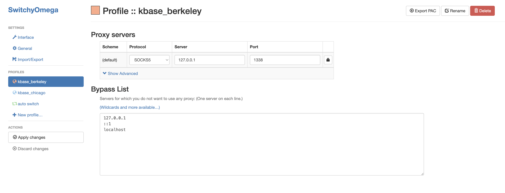
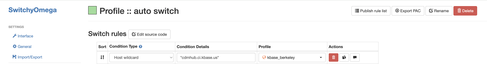
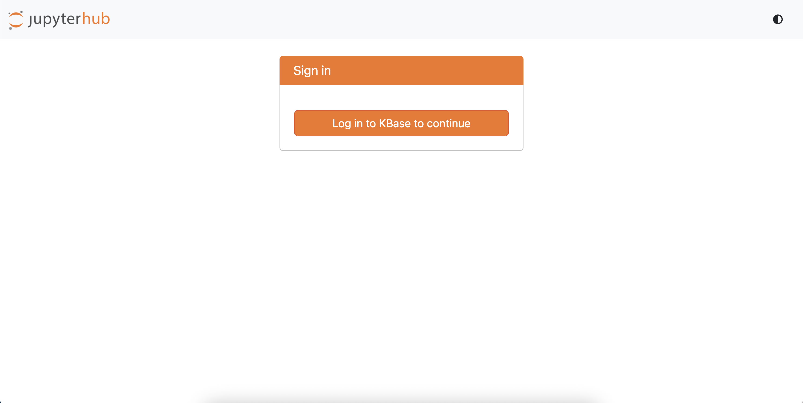
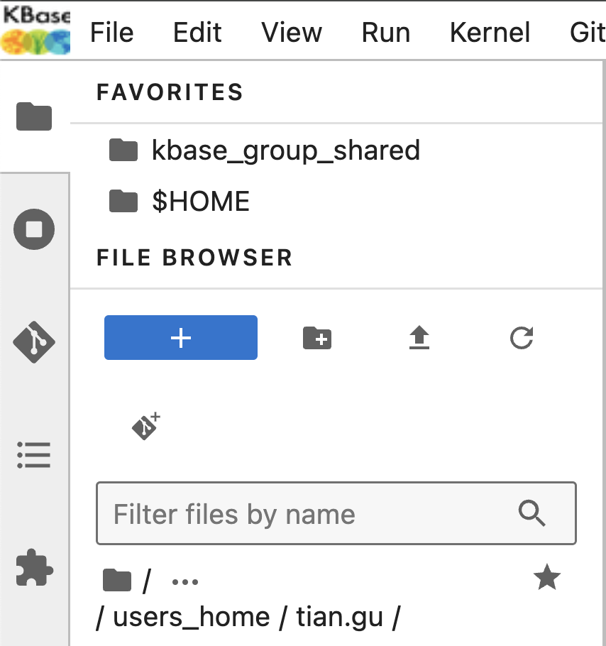
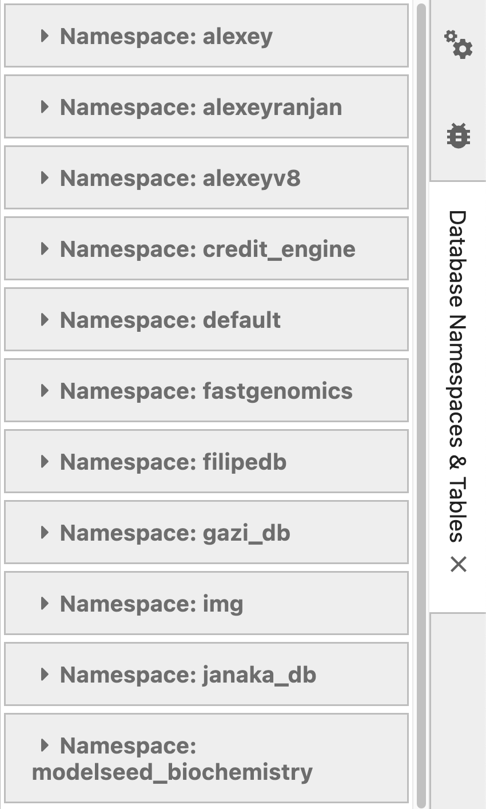

# User Guide: Accessing KBase Jupyterhub

## Prerequisites

### SSH Access:
   * Ensure you have SSH access to the remote server (`login1.berkeley.kbase.us`).
   * If you do not have access, please contact the KBase System Admin team.

## Step-by-Step Guide

### 1. Create SSH Tunnel:

You need to create a secure tunnel from your local machine to the KBase server to access JupyterHub securely.

**Step 1:** Open a terminal on your machine and run the following command:

```bash
ssh -f -D 1338 <ac.anl_username>@login1.berkeley.kbase.us "/bin/sleep infinity"
```

**What this command does:**
* `-f`: Runs SSH in the background
* `-D 1338`: Creates a SOCKS5 proxy on port 1338
* `<ac.anl_username>`: Replace with your actual username
* `"/bin/sleep infinity"`: Keeps the connection open indefinitely

> **⚠️ Note:** If port `1338` is already in use on your system, you can replace it with another free port (e.g., 1080).

**Step 2:** If you haven't set up SSH keys, you'll be prompted to enter your password.

**Step 3:** Verify the tunnel is running by checking for the background process:
```bash
ps aux | grep "ssh -f -D 1338"
```

> **💡 Tip:** To close the tunnel later, find the process ID (PID) and terminate it with `kill <PID>`.

### 2. Configure Your Browser to Use the SOCKS5 Proxy:

#### Option A: Using SwitchyOmega Extension (Recommended)

SwitchyOmega provides a convenient way to manage and switch between different proxy configurations.

**Step 1: Install the Extension**
* [Chrome Web Store](https://chrome.google.com/webstore/detail/proxy-switchyomega/padekgcemlokbadohgkifijomclgjgif)
* [Firefox Add-ons](https://addons.mozilla.org/en-US/firefox/addon/switchyomega/)

**Step 2: Configure Proxy Profile**
1. Click on the SwitchyOmega icon in your browser toolbar and select "Options"
2. Click "New Profile" 
3. Select "Proxy Profile" from the profile type options
4. Name it "kbase_berkeley"
5. Configure the following settings:
   * Protocol: SOCKS5
   * Server: 127.0.0.1
   * Port: 1338 (or the port you specified in your SSH command)
6. Click "Apply Changes" to save your configuration



**Step 3: Set Up Auto Switch (Optional)**
This configuration allows you to use the proxy only for KBase services while maintaining direct connections for other websites.

1. Create another profile:
   * Click "New Profile"
   * Select "Switch Profile" from the profile type options
   * Name it "Auto Switch"
2. Configure the switch rules:
   * Create a routing rule for the `cdmhub` server (using wildcard pattern `*cdmhub.ci.kbase.us*`) that directs traffic through your "kbase_berkeley" profile
   * Set the default profile to "Direct" (or your system default)
3. Click "Apply Changes" to save your configuration



**Step 4: Activate the Proxy**
* Click the SwitchyOmega icon in your browser toolbar
* Select either:
  * "Auto Switch" to only proxy KBase traffic (recommended)
  * "kbase_berkeley" to route all traffic through the proxy
  

#### Option B: Manual Browser Configuration

If you prefer not to use an extension, you can configure proxy settings directly in your browser:

**Chrome/Edge:**
1. Open Settings → Advanced → System → Open proxy settings
2. Follow your operating system's proxy configuration dialog
3. Set up a SOCKS proxy with:
   * Host: 127.0.0.1
   * Port: 1338
   * Type: SOCKS5

**Firefox:**
1. Open Settings → General → Network Settings
2. Select "Manual proxy configuration"
3. Configure the SOCKS proxy:
   * Host: 127.0.0.1
   * Port: 1338
   * Type: SOCKS v5
   * Check "Proxy DNS when using SOCKS v5"
4. Click "OK" to save

> **⚠️ Important:** Remember to switch your browser back to its regular connection when you're done using KBase Jupyterhub.

### 3. Access Jupyter Notebook:
   
**Step 1:** Open a web browser with your configured proxy active

**Step 2:** Navigate to the JupyterHub URL:
```
https://cdmhub.ci.kbase.us/
```

This will open the JupyterHub login interface running on the remote server.


**Step 3:** Log in using your KBase credentials (the same 3rd party identity provider, username and password you use for KBase services).

> **⚠️ Important:** This service currently uses CI KBase environment authentication, not production KBase authentication. If you don't have a KBase account yet, you'll need to register at https://ci.kbase.us/ before proceeding.

### 4. Request MinIO Access:
By default, you have `read-only` access to MinIO and the database catalog. If you require `write` access to create or 
modify tables, please reach out to the KBase CDM Tech team.

### 5. Access the Workspace:
#### 5.1 Home Directory:
After logging in, click on `$HOME` under the `FAVORITES` section to access your personal home directory. 
This directory is exclusive to your account and is where you can store your notebooks and files.

#### 5.2 Shared Directory:
To access shared resources and example notebooks, click on the `kbase_group_shared` folder icon. This directory contains 
shared content available to all users.



### 6. Using Pre-loaded Functions:

To make your development easier, several helper functions and extensions are preloaded in the Jupyter environment.

#### 6.1. Creating a Spark Session:

Use the `get_spark_session` function to create or get a Spark session. 

This function will automatically set up the Spark session with the correct configurations, including setting the 
master URL and other necessary Spark configurations. By using this function, you ensure that your Spark session is 
properly configured to interact with the cluster.

##### Example Usage:
```python
spark = get_spark_session()
```

#### 6.2. Displaying DataFrames:
Use the `display_df` function to display pandas or Spark DataFrames interactively.

The `display_df` function is designed to provide an interactive tabular display of DataFrames within Jupyter Notebooks. 
It leverages the [itables](https://github.com/mwouts/itables) extension, which enhances the display of data tables by providing features like sorting, 
filtering, and pagination directly in the notebook interface.

##### Example Usage:
```python
display_df(spark.sql(f"SELECT * FROM {namespace}.annotation"))
```


### 7. Accessing Data:

#### 7.1 Viewing Tables:
Run `display_namespace_viewer()` in a code cell to display a list of available namespaces along with their 
corresponding tables.



#### 7.2 Showing Available Namespaces and Listing Tables:
To list all namespaces (databases) and display the tables within each namespace, you can use the following code snippet:

```python
namespaces = spark.sql("SHOW DATABASES").collect()

# List tables within each namespace
for namespace in namespaces:
    namespace_name = namespace.namespace
    print(f"Tables in namespace: {namespace_name}")
    spark.sql(f"SHOW TABLES IN {namespace_name}").show(50, truncate=False)
```

### 8. Closing the Spark Session:
Please remember to close the Spark session when you are done with your work. This will release the resources and 
prevent any memory leaks.

```python
spark.stop()
```

Please be aware that your session will automatically close after `1 hour`. Should you require an extension, simply invoke 
`get_spark_session()` to initiate a new session.

### 9. Common Issues and Troubleshooting:

#### 9.1. Resource Issues:

##### Error Message:
```python
24/06/16 00:55:42 WARN TaskSchedulerImpl: Initial job has not accepted any resources; check your cluster UI to ensure that workers are registered and have sufficient resources
```

This warning indicates that the Spark job could not acquire the necessary resources to start execution. Please contact
the CDM team for assistance in resolving this issue.
