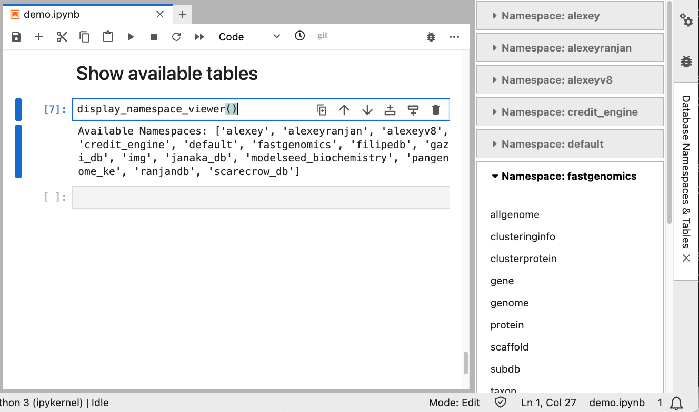

# User Guide: Accessing KBase Jupyterhub

## Prerequisites

### SSH Access:
   * Ensure you have SSH access to the remote server (`login1.berkeley.kbase.us`).
   * If you do not have access, please contact the KBase System Admin team.

## Step-by-Step Guide

### 1. Create SSH Tunnel:

Execute the following command to create an SSH tunnel to the remote server (`login1.berkeley.kbase.us`):

```bash
ssh -f -N -L localhost:44043:10.58.2.201:4043 <ac.anl_username>@login1.berkeley.kbase.us
```
   
* `-f`: Run SSH command in the background.
* `-N`: Do not execute a remote command.
* `-L localhost:44043:10.58.2.201:4043`: Forward port `44043` on your local machine to port `4043` on the remote machine `10.58.2.201`.
* `<ac.anl_username>`: Your username for SSH access. Contact the KBase System Admin team if you do not have access.
* `@login1.berkeley.kbase.us`: The remote SSH server.   
   
### 2. Access Jupyter Notebook:
   
Open a web browser and navigate to the following URL:

```
http://localhost:44043
```
This will open the JupyterHub Notebook interface running on the remote server.

### 3. Access JupyterHub:

#### 3.1 Create a new account:
For first-time users, click the "Sign Up" button to create a new account.

***Note: Please use your KBase account username during sign-up. This ensures that when we transition to KBase 
authentication, your data will remain intact.***


#### 3.2. Log in with Existing Credentials:
If you already have an account, simply log in using your username and password.

(*If you previously used JupyterLab (port `4041` and `4042`), please contact the CDM Tech team to migrate your existing 
data to the new environment.*)

### 4. Request MinIO Access:
By default, you have `read-only` access to MinIO and the database catalog. If you require `write` access to create or 
modify tables, please reach out to the KBase CDM Tech team.

### 5. Access the Workspace:
#### 5.1 Home Directory:
After logging in, click on `$HOME` under the `FAVORITES` section to access your personal home directory. 
This directory is exclusive to your account and is where you can store your notebooks and files.

#### 5.2 Shared Directory:
To access shared resources and example notebooks, click on the `kbase_group_shared` folder icon. This directory contains 
shared content available to all users.


### 6. Using Pre-loaded Functions:

To make your development easier, several helper functions and extensions are preloaded in the Jupyter environment.

#### 6.1. Creating a Spark Session:

Use the `get_spark_session` function to create or get a Spark session. 

This function will automatically set up the Spark session with the correct configurations, including setting the 
master URL and other necessary Spark configurations. By using this function, you ensure that your Spark session is 
properly configured to interact with the cluster.

##### Example Usage:
```python
spark = get_spark_session()
```

#### 6.2. Displaying DataFrames:
Use the `display_df` function to display pandas or Spark DataFrames interactively.

The `display_df` function is designed to provide an interactive tabular display of DataFrames within Jupyter Notebooks. 
It leverages the [itables](https://github.com/mwouts/itables) extension, which enhances the display of data tables by providing features like sorting, 
filtering, and pagination directly in the notebook interface.

##### Example Usage:
```python
display_df(spark.sql(f"SELECT * FROM {namespace}.annotation"))
```


### 7. Accessing Data:

#### 7.1 Viewing Tables:
Run `display_namespace_viewer()` in a code cell to display a list of available namespaces along with their 
corresponding tables.



#### 7.2 Showing Available Namespaces and Listing Tables:
To list all namespaces (databases) and display the tables within each namespace, you can use the following code snippet:

```python
namespaces = spark.sql("SHOW DATABASES").collect()

# List tables within each namespace
for namespace in namespaces:
    namespace_name = namespace.namespace
    print(f"Tables in namespace: {namespace_name}")
    spark.sql(f"SHOW TABLES IN {namespace_name}").show(50, truncate=False)
```

### 8. Closing the Spark Session:
Please remember to close the Spark session when you are done with your work. This will release the resources and 
prevent any memory leaks.

```python
spark.stop()
```

Please be aware that your session will automatically close after `1 hour`. Should you require an extension, simply invoke 
`get_spark_session()` to initiate a new session.

### 9. Common Issues and Troubleshooting:

#### 9.1. Resource Issues:

##### Error Message:
```python
24/06/16 00:55:42 WARN TaskSchedulerImpl: Initial job has not accepted any resources; check your cluster UI to ensure that workers are registered and have sufficient resources
```

This warning indicates that the Spark job could not acquire the necessary resources to start execution. Please contact
the CDM team for assistance in resolving this issue.
